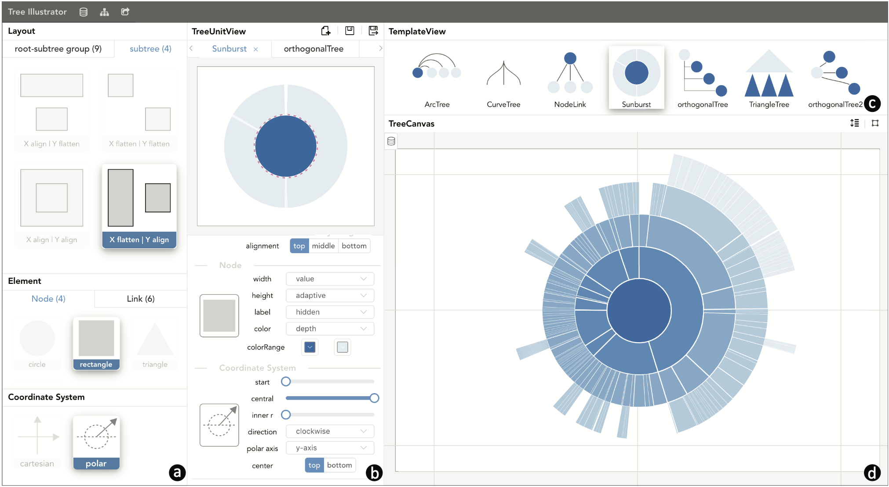

# GoTree: A Grammar of Tree Visualizations

This repo contains the code of the GoTree gallery and the authoring tool - Tree Illustrator, which is developed based on the GoTree library. In this work, We present GoTree, a declarative grammar allowing users to instantiate tree visualizations by specifying three aspects: vi- sual elements, layout, and coordinate system. Within the set of all possible tree visualization techniques, we identify a subset of techniques that are both “unit-decomposable” and “axis-decomposable” (terms we define). For tree visualiza- tions within this subset, GoTree gives the user flexible and fine-grained control over the parameters of the techniques, supporting both explicit and implicit tree visualizations. We developed Tree Illustrator, an interactive authoring tool based on GoTree grammar. Tree Illustrator allows users to create a considerable number of tree visualizations, including not only existing techniques but also undiscovered and hybrid visual- izations. We demonstrate the expressiveness and generative power of GoTree with a gallery of examples and conduct a qualitative study to validate the usability of Tree Illustrator.

> Guozheng Li, Min Tian, Qinmei Xu, Michael J. McGuffin, Xiaoru Yuan. [GoTree: A Grammar of Tree Visualizations.](https://dl.acm.org/doi/10.1145/3313831.3376297) In Proceedings of the 2020 CHI Conference on Human Factors in Computing Systems, pages 1-13, 2020.

Please visit the the url [bit-vis.github.io/gotree](https://bit-vis.github.io/gotree/) for the gallery and Tree Illustrator prototype system. 

## Visualization interface 

The Tree Illustrator user interface consists of four panels: (a) Tree component panel. (b) TreeUnit panel. (c) Tree visualization template panel. (d) Tree canvas panel.
The canvas panel shows the visualization results of the simplest hierarchical data as well as the visual representations of the parameters (e.g., the pink dashed line indi- cates the alignment parameter). 

The configuration panel below shows the parameter widgets of the selected components in this TreeUnit. Users can adjust the TreeUnit through direct manipulations in the canvas panel or parameter widgets in the configuration panel.

After finishing the TreeUnit design, users can save it in the Template panel, which contains many tree visualization tem- plates. Each tree visualization template contains one preview image, and the underlying data of the preview image is the same as that of the TreeUnit panel. Clicking on one preview image in the Template panel will add the corresponding Tree- Unit into the TreeUnit panel and visualize the selected hierar- chical data in the Tree Canvas panel.

